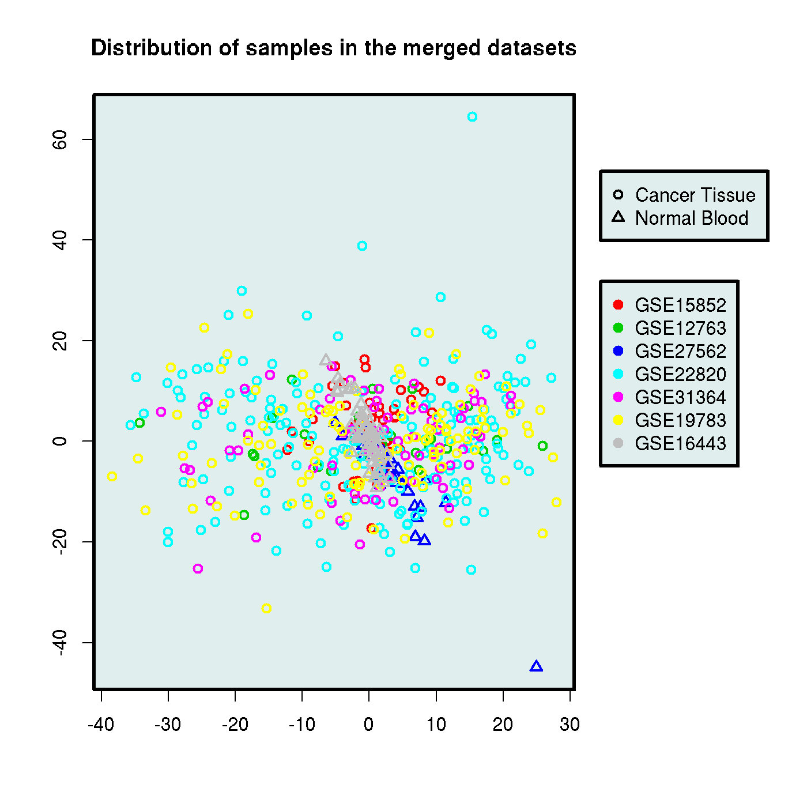
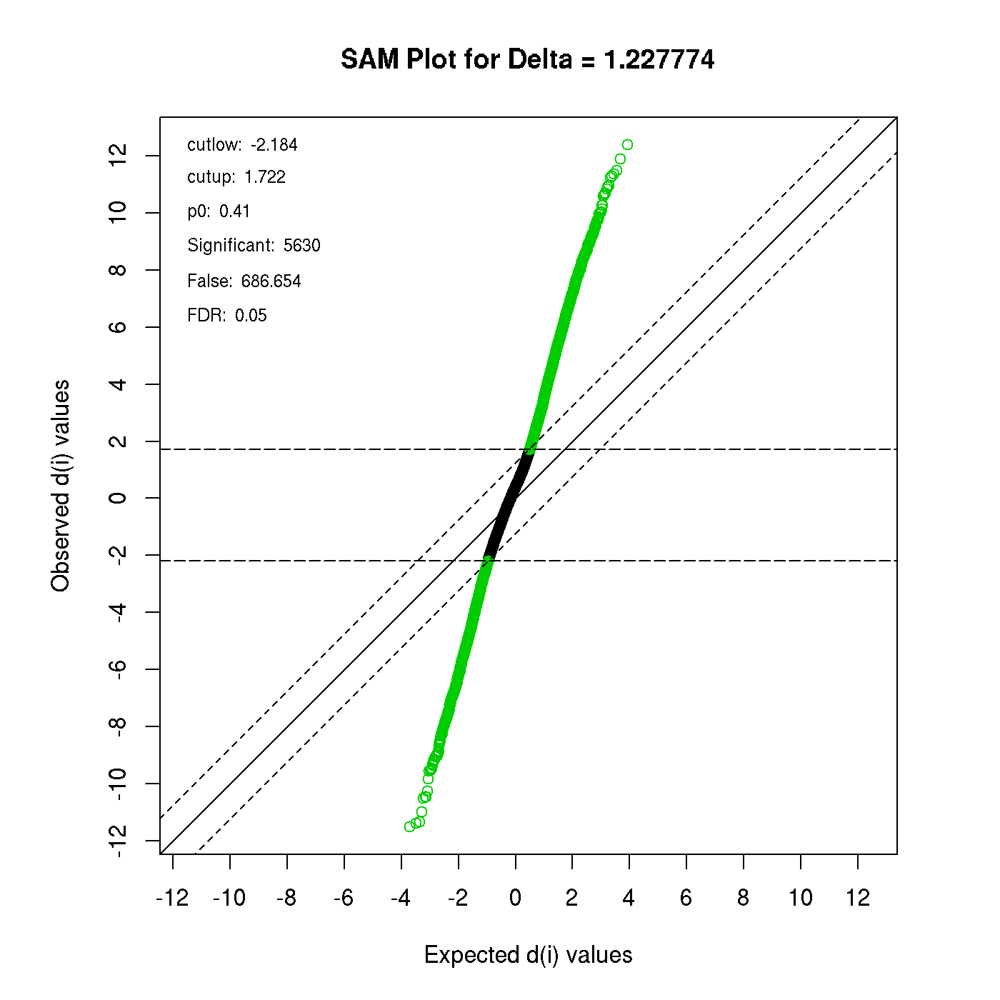

% The CTC saga: C1 comparison
% Stelios Sfakianakis
% Date: 2013/03/15


# Datasets
C1 is the comparison between normal and cancer tissue. We will merge an number of datasets to create a big one and then perform common differential expression algorithms.

Katerina has selected the following datasets:

- [GSE22820](http://www.ncbi.nlm.nih.gov/geo/query/acc.cgi?acc=GSE22820):“Gene expression profiles were generated from 176 primary breast cancer patients and 12 normal breast samples”, PMID: 21356353 (*Agilent Whole Human Genome Microarray 4x44K G4112F*). The GEO dataset contains **176 primary breast cancer** and **10 normal patients**.
- [GSE19783](http://www.ncbi.nlm.nih.gov/geo/query/acc.cgi?acc=GSE19783):“mRNA profiling from 115 breast cancer samples was performed”, PMID: 21364938 (*Agilent Whole Human Genome Microarray 4x44K G4112F*) Here two samples represent metastatic tumors and were removed so we finally keep **113** breast cancer samples.
- [GSE31364](http://www.ncbi.nlm.nih.gov/geo/query/acc.cgi?acc=GSE31364):“Seventy-two primary breast cancer tumor have been analyzed against a breast cancer reference pool.”, PMID: 22384245 (*Agendia_human_DiscoverPrint_v1* **custom platform**) All samples are kept.
- [GSE9574](http://www.ncbi.nlm.nih.gov/geo/query/acc.cgi?acc=GSE9574): "Gene expression abnormalities in histologically normal breast epithelium of breast cancer patients", PMID: 18058819 (*Affymetrix Human Genome U133A Array*). We selected **14 normal samples** that have been identified as "disease-state: normal (reduction mammoplasty)"
- [GSE18672](http://www.ncbi.nlm.nih.gov/geo/query/acc.cgi?acc=GSE18672): "Mammographic density and genetics - A study of breast biopsies in relation to mammoraphic density", PMID: 20799965 (Agilent Whole Human Genome Oligo Microarray G4112A). Here we used all the **79 women with no malignancy** (healthy women) and **64 newly diagnosed breast cancer patients**.

## Filtering Genes per Dataset

A "non specific" filtering is performed in each data set:


```r
> nsFilter(gse, require.entrez = TRUE, remove.dupEntrez = TRUE, var.func = IQR, 
+     var.cutoff = 0.5, var.filter = FALSE)
> 
```


where `gse` is the dataset. This means that probes/transcripts that do not map in Entrez genes identifiers are removed and in the case that multiple probes map to the same identifier we remove all but one that has the largest IQR (i.e. the largest variance).

In some datasets where there were missing values I did imputation with the 10 "nearest neighbors". 

Now loading the data:


# Merging

I am using the [inSilicoMerging](http://www.bioconductor.org/packages/2.11/bioc/html/inSilicoMerging.html) package of Bioconductor that features some of the most well known cross platform normalization methods (COMBAT is [Empirical Bayes](http://biostatistics.oxfordjournals.org/content/8/1/118.abstract), DWD stands for [Distance Weighted Discrimination](http://bioinformatics.oxfordjournals.org/content/20/1/105.short), and  GENENORM means gene "z-score" normalization) for the merger of these datasets:


```r
> require(inSilicoMerging)
> mgse_COMBAT <- merge(datasets, method = "COMBAT")
```


The distribution of the different classes in the initial datasets is shown in the next 
table:

% latex table generated in R 2.15.1 by xtable 1.7-1 package
% Tue Jun  4 19:15:54 2013
\begin{table}[ht]
\centering
\begin{tabular}{rrrrrr}
  \hline
 & GSE18672 & GSE19783 & GSE22820 & GSE31364 & GSE9574 \\ 
  \hline
Cancer &  64 & 113 & 176 &  72 &  14 \\ 
  Control &  79 &   2 &  10 &   0 &  15 \\ 
   \hline
\end{tabular}
\end{table}


For each dataset we keep specific samples in the final (merged) dataset.


```r
> gse22820_samples = sampleNames(gse22820)
> gse31364_samples = sampleNames(gse31364)
> gse18672_samples = sampleNames(gse18672)
> 
> ## Two samples are metastatic -- remove those!!
> idx = gse19783$characteristics_ch1.1 == "disease state: Breast Primary Tumor"
> ## and keep the rest which are all tumor
> gse19783_samples = sampleNames(gse19783[, idx])
> 
> # Keep only the normal
> idx = gse9574$characteristics_ch1 == "disease-state: normal (reduction mammoplasty)"
> gse9574_samples = sampleNames(gse9574[, idx])
> 
> 
> samples = c(gse22820_samples, gse19783_samples, gse31364_samples, gse18672_samples, 
+     gse9574_samples)
> 
> c1.data = mgse_COMBAT[, samples]
```


After the selection of samples their distribution is as follows:

% latex table generated in R 2.15.1 by xtable 1.7-1 package
% Tue Jun  4 19:16:00 2013
\begin{table}[ht]
\centering
\begin{tabular}{rrrrrr}
  \hline
 & GSE18672 & GSE19783 & GSE22820 & GSE31364 & GSE9574 \\ 
  \hline
Cancer &  64 & 113 & 176 &  72 &   0 \\ 
  Control &  79 &   0 &  10 &   0 &  15 \\ 
   \hline
\end{tabular}
\end{table}


We can compare the output (how the different data sets are mixed together) by computing a [Multidimensional Scaling](http://en.wikipedia.org/wiki/Multidimensional_scaling) (MDS) plot for the 3 methods used:


```r
> plotMDS(c1.data, "Study", "Disease", main = "Distribution of samples in the merged datasets")
```

 


The plot is shown in Figure 1. 

After the merging and selection of samples what is the proportion of normal versus tumor cases?


```r
> dim(c1.data)
```

```
Features  Samples 
   11928      529 
```

```r
> table(c1.data$Disease)
```

```

 Cancer Control 
    425     104 
```


## Gene selection

I am using [Significance Analysis of Microarrays](http://www-stat.stanford.edu/~tibs/SAM/) (SAM) for finding differential expressed genes. We try to select the differentially expressed genes so that the estimated False Discovery Rate (FDR) to be bounded by `0.05` (i.e. to expect 1% falsely assumed differentially expressed genes): 


```r
> cl = ifelse(c1.data$Disease == "Control", 0, 1)
> sam.out <- sam(exprs(c1.data), cl, B = 500, rand = 57005)
> dd <- findDelta(sam.out, fdr = 0.05, verbose = FALSE)[2, 1]
```

```
The threshold seems to be at 
  Delta Called     FDR
5  1.22   5731 0.05002
6  1.22   5730 0.04984
```


So by choosing 1.2198 as our "delta" 

```r
> sam.sum <- summary(sam.out, delta = dd)
> ee = exprs(c1.data)[sam.sum@row.sig.genes, ]
> num.diff.exp = dim(ee)[1]
```

we find 5730 differential expressed genes:


```r
> plot(sam.out, dd)
```

 


Let's find out which of the genes are over-expressed in cancer samples:


```r
> w <- which(sam.sum@mat.sig$d.value > 0)
> num.genes.over <- length(w)
> num.genes.over
```

```
[1] 3725
```

```r
> siggenes.all <- list.siggenes(sam.out, dd)
> siggenes.over <- list.siggenes(sam.out, dd)[w]
```


So there are 3725 genes over-expressed in cancer state.


[^1]: Wirapati, P.; Sotiriou, C.; Kunkel, S.; Farmer, P.; Pradervand, S.; Haibe-Kains, B.; Desmedt, C.; Ignatiadis, M.; Sengstag, T.; Schütz, F.; Goldstein, D. R.; Piccart, M. & Delorenzi, M. (2008), 'Meta-analysis of gene expression profiles in breast cancer: toward a unified understanding of breast cancer subtyping and prognosis signatures', Breast Cancer Res 10 (4) .

