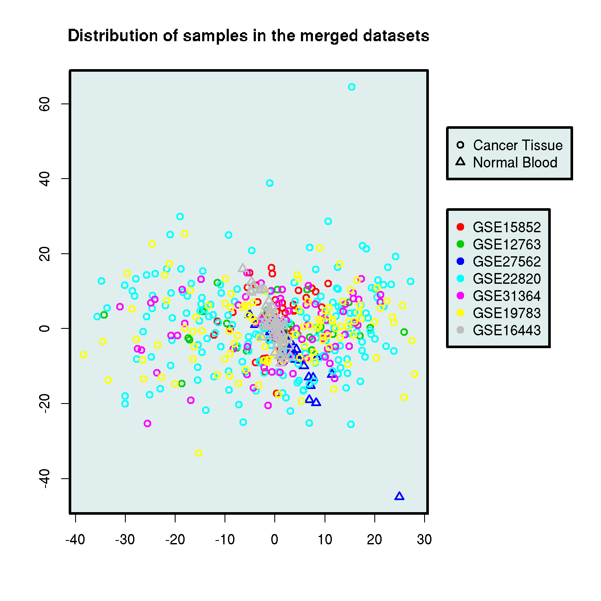

% The CTC saga: C3 comparison
% Stelios Sfakianakis
% Date: 2013/03/18


# C3 comparison

This is the comparison between cancer tissue and normal blood. We are using the cancer tissue samples from the c1 comparison, i.e.:

- [GSE22820](http://www.ncbi.nlm.nih.gov/geo/query/acc.cgi?acc=GSE22820):"Gene expression profiles were generated from **176** primary breast cancer patients and 12 normal breast samples", PMID: 21356353 (*Agilent Whole Human Genome Microarray 4x44K G4112F*): **176 cancer tissues** (we don't take 2 metastatic cancers)
- [GSE19783](http://www.ncbi.nlm.nih.gov/geo/query/acc.cgi?acc=GSE19783):"mRNA profiling from **115** breast cancer samples was performed", PMID: 21364938 (*Agilent Whole Human Genome Microarray 4x44K G4112F*) : **113 cancer tissues**
- [GSE31364](http://www.ncbi.nlm.nih.gov/geo/query/acc.cgi?acc=GSE31364):"Seventy-two primary breast cancer tumor have been analyzed against a breast cancer reference pool.", PMID: 22384245 (*Agendia_human_DiscoverPrint_v1* **custom platform**) : **72 cancer tissues**
- [GSE18672](http://www.ncbi.nlm.nih.gov/geo/query/acc.cgi?acc=GSE18672): "Mammographic density and genetics - A study of breast biopsies in relation to mammoraphic density", PMID: 20799965 (Agilent Whole Human Genome Oligo Microarray G4112A): **64 cancer tissues**

Furthermore we are using the following datasets providing cancer samples:

- [GSE15852](http://www.ncbi.nlm.nih.gov/geo/query/acc.cgi?acc=GSE15852): "Gene expression patterns distinguish breast carcinomas from normal breast tissues: the Malaysian context" (PMID: [20097481](http://www.ncbi.nlm.nih.gov/pubmed/20097481)). Platform: Affymetrix genechip U133A. **43 cancer patients**
- [GSE12763](http://www.ncbi.nlm.nih.gov/geo/query/acc.cgi?acc=GSE12763): "In vivo antitumor activity of MEK and phosphatidylinositol 3-kinase inhibitors in basal-like breast cancer models" (PMID: [19567590](http://www.ncbi.nlm.nih.gov/pubmed/19567590)). Platform: Affymetrix Human Genome U133 Plus 2.0 Array **30 human breast cancers**

For the normal blood samples we are using the ones from (my) c2 comparison, that is:

- [GSE27562](http://www.ncbi.nlm.nih.gov/geo/query/acc.cgi?acc=GSE27562): "In total, we collected blood from 57 women with a diagnosis of breast cancer and 37 with a benign diagnosis"  (PMID: [21781289](http://www.ncbi.nlm.nih.gov/pubmed/21781289)) Platform: Affymetrix : **31 normal blood samples**
- [GSE16443](http://www.ncbi.nlm.nih.gov/geo/query/acc.cgi?acc=GSE16443): "Diagnostic work-up revealed that 67 of these women had breast cancer while 54 had no malignant disease. Additionally, 9 samples from 6 healthy female controls (three pregnant women, one breast-feeding woman and two healthy controls at different timepoints in their menstrual cycle) were included." (PMID: [20078854](http://www.ncbi.nlm.nih.gov/pubmed/20078854)). Platform: Applied Biosystems (ABI) : **54 normal blood samples**


The merge of these datasets result in 6421 (common) genes and 510 samples (85 normal blood samples and 425 cancer tissue).
    

```r
> print.xtable(xtable(table(c3.data$Origin, c3.data$Study)), comment = FALSE)
```

\begin{table}[ht]
\centering
\begin{tabular}{rrrrrrrr}
  \hline
 & GSE12763 & GSE15852 & GSE16443 & GSE19783 & GSE22820 & GSE27562 & GSE31364 \\ 
  \hline
Cancer Tissue &  30 &  43 &   0 & 113 & 176 &   0 &  72 \\ 
  Normal Blood &   0 &   0 &  54 &   0 &   0 &  31 &   0 \\ 
   \hline
\end{tabular}
\end{table}


```r
> plotMDS(c3.data, "Study", "Origin", main = "Distribution of samples in the merged datasets")
```

 


## Differential expression


```r
> cl = ifelse(c3.data$Origin == "Normal Blood", 0, 1)
> sam.out = sam(exprs(c3.data), cl, B = 500, rand = 57005)
> delta = findDelta(sam.out, fdr = 0.05)[2, 1]
```

```
The threshold seems to be at 
  Delta Called     FDR
5 1.022    356 0.05007
6 1.022    355 0.04873
```

```r
> 
> sam.sum <- summary(sam.out, delta)
> w <- which(sam.sum@mat.sig$d.value > 0)
> num.genes.over <- length(w)
> siggenes.over <- list.siggenes(sam.out, delta)[w]
```


We find 275 genes over-expressed in cancer samples.
